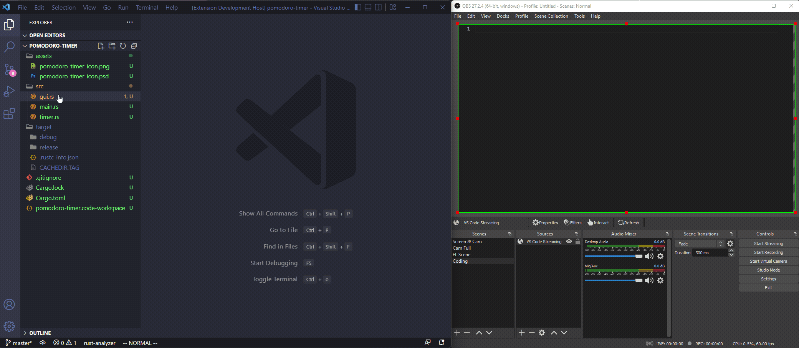

# VS Code Streaming Screen

VS Code extension to display the code in a seperate window that can be used as a browser source for streaming software. This allows a display specifically adapted to the stream without having to change the display for the programmer/streamer.

## Why?

I like to program on a big screen with very little font size, so that I can as much as possible from the file I'm working on. But for a stream viewer this is nearly impossible to read, because of the streaming resolution and sometimes the distance to the screen. I tried to zoom in OBS, but then it becomes blurry very quickly and I often coded offscreen.

## How?

The idea is to use a seperate VS Code web instance and sync it with your real VS Code. You can configure the web instance how you want your viewers to see the code. The extension starts a local webserver (http://localhost:1870/), which you can access with any modern browser, or a browser source in any streaming software.

## Features

- Cursor synchronization
- Syntax highlighting
- Cursor focusation
- Selection synchronization

## Requirements

To run this, you need just VS Code and any streaming software, which can show a browser source.

## Extension Settings

// TODO

This extension contributes the following settings:

- `.port`: Port for local webserver and websocket connection. Must be the same as in web instance settings.

## Known Issues

- No Text decoration sync (At the moment not possible, because there is no way to get them over the vscode extension api. At least I do not know of any solution)
- Cursor doesn't show, if you interacted with the web instance. Just reload the browser source/window and it should work again.

## Additional Help

- CSS animations: 

**Enjoy!**
